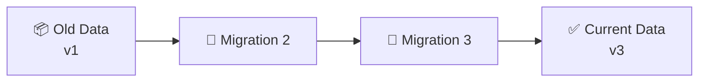

# 🔄 Migrations

Migrations allow you to evolve your data schema over time without losing existing player data.

---

## 📚 What Are Migrations?

When you change your `dataTemplate`, existing saved data won't automatically have the new structure. Migrations are functions that transform old data into the new format.



---

## 🛠️ Creating Migrations

Add migration functions to your schema's `migrations` array:

```lua
local PlayerSchema = Coppermind.registerSchema({
    name = "PlayerData",
    dataTemplate = {
        coins = 0,
        gems = 0,
        diamonds = 0,  -- Added in v2
        settings = {   -- Added in v3
            musicEnabled = true,
        },
    },
    migrations = {
        -- Migration 1: Initial version (often empty)
        function(data)
            -- Nothing to do for v1
        end,
        
        -- Migration 2: Add diamonds field
        function(data)
            data.diamonds = 0
        end,
        
        -- Migration 3: Add settings
        function(data)
            data.settings = {
                musicEnabled = true,
            }
        end,
    },
})
```

---

## ⚙️ How Migrations Work

| Step | Description |
|:-----|:------------|
| 1️⃣ | Each saved data entry has a `version` number |
| 2️⃣ | When loading, Coppermind compares saved version to migration count |
| 3️⃣ | All migrations from `savedVersion + 1` to `currentVersion` run |
| 4️⃣ | Data is reconciled with the template |

### Example Flow

```
📦 Saved data (version 1):
{ coins = 500 }

🔄 Migrations 2 and 3 run:
{ coins = 500, diamonds = 0, settings = { musicEnabled = true } }

✅ Reconciliation with template:
{ coins = 500, gems = 0, diamonds = 0, settings = { musicEnabled = true } }
```

---

## ✅ Migration Best Practices

import Tabs from '@theme/Tabs';
import TabItem from '@theme/TabItem';

<Tabs>
<TabItem value="never-remove" label="🚫 Never Remove" default>

:::danger Keep Forever
Once deployed, migrations should **never** be removed!
:::

```lua
migrations = {
    function(data) end,           -- v1 - keep forever
    function(data) 
        data.newField = 0 
    end,                          -- v2 - keep forever
    function(data) 
        data.anotherField = "" 
    end,                          -- v3 - keep forever
}
```

</TabItem>
<TabItem value="handle-missing" label="🛡️ Handle Missing">

```lua
function(data)
    -- Check before accessing nested tables
    if not data.stats then
        data.stats = {}
    end
    
    data.stats.newStat = 0
end
```

</TabItem>
<TabItem value="preserve-data" label="💾 Preserve Data">

```lua
-- ✅ Good - preserves existing value or sets default
function(data)
    data.gems = data.gems or 0
end

-- ❌ Bad - overwrites existing data
function(data)
    data.gems = 0  -- Would reset player's gems!
end
```

</TabItem>
<TabItem value="transform" label="🔀 Transform">

```lua
-- Renaming a field
function(data)
    data.currency = data.coins or 0
    data.coins = nil  -- Remove old field
end

-- Restructuring nested data
function(data)
    if data.musicVolume then
        data.settings = data.settings or {}
        data.settings.musicVolume = data.musicVolume
        data.musicVolume = nil
    end
end
```

</TabItem>
</Tabs>

---

## 🧩 Complex Migration Examples

### 📂 Restructuring Data

```lua
-- Before: { level = 5, xp = 100, ... }
-- After: { stats = { level = 5, xp = 100 }, ... }

function(data)
    data.stats = {
        level = data.level or 1,
        xp = data.xp or 0,
    }
    data.level = nil
    data.xp = nil
end
```

### 📋 Converting Array Formats

```lua
-- Before: { inventory = { "sword", "shield" } }
-- After: { inventory = { { id = "sword", count = 1 }, { id = "shield", count = 1 } } }

function(data)
    if data.inventory and type(data.inventory[1]) == "string" then
        local newInventory = {}
        for _, itemId in data.inventory do
            table.insert(newInventory, {
                id = itemId,
                count = 1,
            })
        end
        data.inventory = newInventory
    end
end
```

### 🧮 Adding Computed Defaults

```lua
-- Set initial value based on existing data
function(data)
    -- Veterans get a bonus
    if data.playtime and data.playtime > 3600 then
        data.veteranBonus = 100
    else
        data.veteranBonus = 0
    end
end
```

---

## 🧪 Testing Migrations

:::tip Use Mock Mode
Test migrations without affecting real player data!
:::

```lua
Coppermind.setMockMode(true)
Coppermind.clearMockData()

-- Simulate old data
local store = Coppermind.loadStore(PlayerSchema, "test_key", {})
task.wait(0.2)

-- Verify migrations ran correctly
local data = Coppermind.getData(PlayerSchema, "test_key")
assert(data.newField ~= nil, "Migration should add newField")

Coppermind.unloadStore(PlayerSchema, "test_key")
Coppermind.setMockMode(false)
```

---

## 📊 Version Tracking

The store's `version` property tracks which migrations have been applied:

```lua
local store = Coppermind.loadStore(schema, key, {})

store.onReady:Connect(function()
    print("Data version:", store.version)
    -- This equals the number of migrations that have been applied
end)
```

---

## 🐛 Debugging Migrations

:::info Development Only
Remove debug logging before deploying to production!
:::

```lua
migrations = {
    function(data)
        print("[Migration 1] Running...")
        data.newField = data.newField or "default"
        print("[Migration 1] Complete")
    end,
    function(data)
        print("[Migration 2] Running...")
        print("[Migration 2] Current data:", data)
        data.anotherField = true
        print("[Migration 2] Complete")
    end,
}
```
