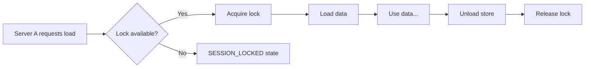

# 📂 Stores

Stores are the core of Coppermind — they represent individual data entries that can be loaded, saved, and managed.

---

## 📥 Loading a Store

Use `loadStore` to load data for a specific key:

```lua
local store = Coppermind.loadStore(PlayerSchema, tostring(player.UserId), {
    sessionLocked = true,
    autoSave = 60,
})
```

### Parameters

| Parameter | Type | Description |
|:----------|:-----|:------------|
| `schema` | `Schema` | The registered schema to use |
| `key` | `string` | Unique identifier for this data entry |
| `config` | `StoreConfig?` | Optional configuration |

### Configuration Options

```lua
{
    sessionLocked = true,  -- 🔒 Lock data to this server
    autoSave = 60,         -- ⏱️ Auto-save interval in seconds
}
```

---

## 📊 Store Properties

```lua
local store = Coppermind.loadStore(schema, key, config)

print(store.key)        -- "123456789" (identifier)
print(store.data)       -- { coins = 100, ... } (nil while loading)
print(store.state)      -- "READY" (current state)
print(store.sessionId)  -- "abc-123-def" (if session locked)
print(store.version)    -- 2 (migration version)
print(store.lastSaved)  -- 1703712000 (timestamp)
```

---

## 🚦 Store States

| State | Icon | Description |
|:------|:----:|:------------|
| `LOADING` | 🔄 | Fetching data from DataStore |
| `READY` | ✅ | Data loaded and available for use |
| `SAVING` | 💾 | Currently saving to DataStore |
| `UNLOADING` | 📤 | Saving and releasing the store |
| `UNLOADED` | ⬜ | Store has been released |
| `ERROR` | ❌ | Failed to load or save |
| `SESSION_LOCKED` | 🔒 | Another server owns this data |

---

## 📡 Store Events

Each store has its own events:

```lua
-- ✅ Fires when data is loaded and ready
store.onReady:Connect(function(store)
    print("Store ready:", store.key)
end)

-- 💾 Fires after each successful save
store.onSaved:Connect(function(store)
    print("Store saved:", store.key)
end)

-- ❌ Fires on any error
store.onError:Connect(function(store, errorMessage)
    warn("Store error:", store.key, errorMessage)
end)

-- 💱 Fires when a transaction is completed
store.onTransaction:Connect(function(store, transactionId)
    print("Transaction completed:", transactionId)
end)
```

---

## 🔍 Checking Store Status

### Is Loaded

```lua
if Coppermind.isLoaded(PlayerSchema, key) then
    print("Store is loaded")
end
```

### Get Store Reference

```lua
local store = Coppermind.getStore(PlayerSchema, key)

if store and store.state == "READY" then
    print("Store is ready")
end
```

---

## 💾 Saving a Store

import Tabs from '@theme/Tabs';
import TabItem from '@theme/TabItem';

<Tabs>
<TabItem value="manual" label="Manual Save" default>

```lua
local success = Coppermind.saveStore(PlayerSchema, key)

if success then
    print("Save queued")
end
```

</TabItem>
<TabItem value="auto" label="Auto-Save">

Configure when loading:

```lua
local store = Coppermind.loadStore(schema, key, {
    autoSave = 30,  -- Save every 30 seconds
})
```

:::tip Auto-Save Behavior
Auto-save automatically pauses during manual saves and resumes after.
:::

</TabItem>
</Tabs>

---

## 📤 Unloading a Store

:::warning Always Unload
Always unload stores when no longer needed to prevent data loss!
:::

```lua
local success = Coppermind.unloadStore(PlayerSchema, key)
```

**Unloading performs these steps:**
1. ⏹️ Cancels any pending auto-save
2. 💾 Saves current data
3. 🔓 Releases the session lock
4. 🗑️ Removes the store from memory

### Typical Usage

```lua
game.Players.PlayerRemoving:Connect(function(player)
    local key = tostring(player.UserId)
    
    if Coppermind.isLoaded(PlayerSchema, key) then
        Coppermind.unloadStore(PlayerSchema, key)
    end
end)
```

---

## 🔒 Session Locking

Session locking prevents multiple servers from modifying the same data:

```lua
local store = Coppermind.loadStore(schema, key, {
    sessionLocked = true,
})
```

### How It Works



1. When loading, Coppermind checks if another server owns the lock
2. If locked, the store enters `SESSION_LOCKED` state
3. If available, this server acquires the lock
4. The lock is released when the store is unloaded

### ⏰ Lock Expiration

:::info Automatic Expiration
Locks automatically expire after **30 minutes**. This handles cases where a server crashes without properly unloading.
:::

### Handling Lock Conflicts

```lua
store.onError:Connect(function(store, errorMessage)
    if store.state == "SESSION_LOCKED" then
        warn("Data is locked by another server")
        -- Optionally kick the player or retry later
    end
end)
```

---

## 📝 Complete Example

```lua
local Coppermind = require(path.to.Coppermind)

local PlayerSchema = Coppermind.registerSchema({
    name = "PlayerData",
    dataTemplate = {
        coins = 0,
        playtime = 0,
    },
    migrations = {},
})

local function onPlayerAdded(player)
    local key = tostring(player.UserId)
    
    local store = Coppermind.loadStore(PlayerSchema, key, {
        sessionLocked = true,
        autoSave = 60,
    })
    
    store.onReady:Connect(function()
        print(`{player.Name}'s data loaded!`)
    end)
    
    store.onError:Connect(function(_, errorMessage)
        warn(`Failed to load {player.Name}'s data: {errorMessage}`)
        player:Kick("Failed to load your data. Please rejoin.")
    end)
end

local function onPlayerRemoving(player)
    local key = tostring(player.UserId)
    
    if Coppermind.isLoaded(PlayerSchema, key) then
        Coppermind.unloadStore(PlayerSchema, key)
    end
end

game.Players.PlayerAdded:Connect(onPlayerAdded)
game.Players.PlayerRemoving:Connect(onPlayerRemoving)

-- Handle existing players (for late script execution)
for _, player in game.Players:GetPlayers() do
    task.spawn(onPlayerAdded, player)
end
```
