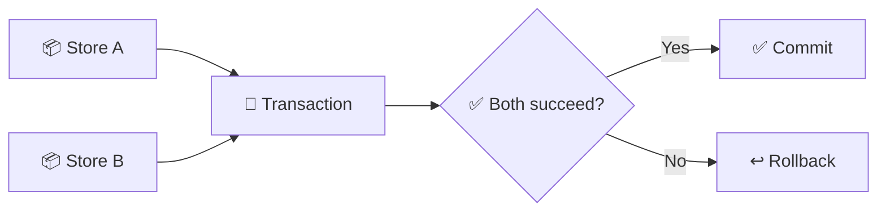

# 🔐 Transactions

Transactions allow you to atomically modify data across two stores. Either both changes succeed, or neither does.

---

## 🤔 Why Transactions?

Consider a trading system where two players exchange items:

```lua
-- ❌ Dangerous - if the second update fails, data is inconsistent
Coppermind.updateData(schema, playerA, function(data)
    table.remove(data.inventory, itemIndex)
    return nil
end)

Coppermind.updateData(schema, playerB, function(data)
    table.insert(data.inventory, item)  -- What if this fails?
    return nil
end)
```

:::danger Data Inconsistency
Without transactions, a failure in the second operation leaves your data in an inconsistent state!
:::

Transactions solve this by ensuring both changes succeed or both are rolled back.



---

## 🚀 Using Transactions

```lua
local success, result = Coppermind.transaction(
    PlayerSchema,
    keyA,
    keyB,
    function(dataA, dataB)
        -- Modify both data tables
        local item = table.remove(dataA.inventory, 1)
        table.insert(dataB.inventory, item)
        
        dataB.coins -= 100
        dataA.coins += 100
        
        return true  -- Commit the transaction
    end
)

if success then
    print("Transaction completed! ID:", result)
else
    print("Transaction failed:", result)
end
```

---

## 📋 Transaction Callback

The callback receives mutable copies of both stores' data:

import Tabs from '@theme/Tabs';
import TabItem from '@theme/TabItem';

<Tabs>
<TabItem value="commit" label="✅ Commit" default>

```lua
function(dataA, dataB)
    -- Modify dataA and dataB
    dataA.coins += 100
    dataB.coins -= 100
    
    return true  -- Commit changes
end
```

</TabItem>
<TabItem value="abort" label="❌ Abort">

```lua
function(dataA, dataB)
    if dataB.coins < 100 then
        return false, "Not enough coins"  -- Abort with reason
    end
    
    -- Won't reach here if aborted
    return true
end
```

</TabItem>
<TabItem value="implicit" label="💡 Implicit Commit">

```lua
function(dataA, dataB)
    dataA.coins += 100
    dataB.coins -= 100
    
    -- Return nil/nothing = implicit commit
end
```

</TabItem>
</Tabs>

---

## ⛔ Aborting Transactions

Return `false` with an optional reason to abort:

```lua
local success, result = Coppermind.transaction(
    PlayerSchema,
    buyerKey,
    sellerKey,
    function(buyerData, sellerData)
        local itemPrice = 500
        
        -- Validate before modifying
        if buyerData.coins < itemPrice then
            return false, "Buyer has insufficient coins"
        end
        
        if #sellerData.inventory == 0 then
            return false, "Seller has no items"
        end
        
        -- Proceed with trade
        buyerData.coins -= itemPrice
        sellerData.coins += itemPrice
        
        local item = table.remove(sellerData.inventory, 1)
        table.insert(buyerData.inventory, item)
        
        return true
    end
)

if not success then
    warn("Trade failed:", result)
end
```

---

## ✅ Transaction Requirements

Both stores must meet these requirements:

| Requirement | Description |
|:------------|:------------|
| 📦 Same Schema | Both stores must use the same schema |
| ✅ Ready State | Must be in `READY` or `SAVING` state |
| 📄 Valid Data | Both stores must have valid data |

```lua
-- Check stores before transaction
local storeA = Coppermind.getStore(schema, keyA)
local storeB = Coppermind.getStore(schema, keyB)

if not storeA or storeA.state ~= "READY" then
    return false, "Player A's data not ready"
end

if not storeB or storeB.state ~= "READY" then
    return false, "Player B's data not ready"
end

-- Now safe to transact
Coppermind.transaction(schema, keyA, keyB, callback)
```

---

## 📢 Transaction Events

Stores fire `onTransaction` when a transaction completes:

```lua
store.onTransaction:Connect(function(store, transactionId)
    print("Completed transaction:", transactionId)
end)
```

---

## ⏳ Pending Transactions

Check if a store has pending transactions:

```lua
local pending = Coppermind.getPendingTransactionCount(schema, key)

if pending > 0 then
    print("Store has", pending, "pending transactions")
end
```

---

## 💡 Practical Examples

<Tabs>
<TabItem value="trading" label="🔄 Trading System" default>

```lua
local function trade(
    sellerKey: string,
    buyerKey: string,
    itemId: string,
    price: number
): (boolean, string?)
    return Coppermind.transaction(
        PlayerSchema,
        sellerKey,
        buyerKey,
        function(sellerData, buyerData)
            -- Find item in seller's inventory
            local itemIndex = table.find(sellerData.inventory, itemId)
            
            if not itemIndex then
                return false, "Seller doesn't have item"
            end
            
            if buyerData.coins < price then
                return false, "Buyer can't afford item"
            end
            
            -- Execute trade
            table.remove(sellerData.inventory, itemIndex)
            table.insert(buyerData.inventory, itemId)
            
            sellerData.coins += price
            buyerData.coins -= price
            
            return true
        end
    )
end
```

</TabItem>
<TabItem value="gift" label="🎁 Gift System">

```lua
local function giftCoins(
    senderKey: string,
    receiverKey: string,
    amount: number
): (boolean, string?)
    return Coppermind.transaction(
        PlayerSchema,
        senderKey,
        receiverKey,
        function(senderData, receiverData)
            if senderData.coins < amount then
                return false, "Insufficient coins"
            end
            
            senderData.coins -= amount
            receiverData.coins += amount
            
            return true
        end
    )
end
```

</TabItem>
<TabItem value="swap" label="🔀 Item Swap">

```lua
local function swapItems(
    keyA: string,
    keyB: string,
    itemFromA: string,
    itemFromB: string
): (boolean, string?)
    return Coppermind.transaction(
        PlayerSchema,
        keyA,
        keyB,
        function(dataA, dataB)
            local indexA = table.find(dataA.inventory, itemFromA)
            local indexB = table.find(dataB.inventory, itemFromB)
            
            if not indexA then
                return false, "Player A doesn't have " .. itemFromA
            end
            
            if not indexB then
                return false, "Player B doesn't have " .. itemFromB
            end
            
            -- Swap items
            dataA.inventory[indexA] = itemFromB
            dataB.inventory[indexB] = itemFromA
            
            return true
        end
    )
end
```

</TabItem>
</Tabs>

---

## ✅ Best Practices

### 1. 🛡️ Validate Early

:::tip Validate First
Check conditions before modifying data to avoid unnecessary work!
:::

```lua
function(dataA, dataB)
    -- Validate first
    if not canTrade(dataA, dataB) then
        return false, "Cannot trade"
    end
    
    -- Then modify
    executeTrade(dataA, dataB)
    return true
end
```

### 2. ⚠️ Handle Failures Gracefully

```lua
local success, result = Coppermind.transaction(...)

if not success then
    -- Inform players
    notifyPlayer(playerA, "Trade failed: " .. result)
    notifyPlayer(playerB, "Trade failed: " .. result)
end
```

### 3. 📝 Log Transactions

```lua
local success, txId = Coppermind.transaction(...)

if success then
    print(`[Transaction {txId}] {keyA} <-> {keyB}: Completed`)
else
    warn(`[Transaction] {keyA} <-> {keyB}: Failed - {txId}`)
end
```
